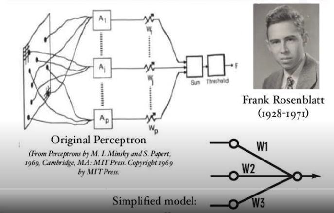
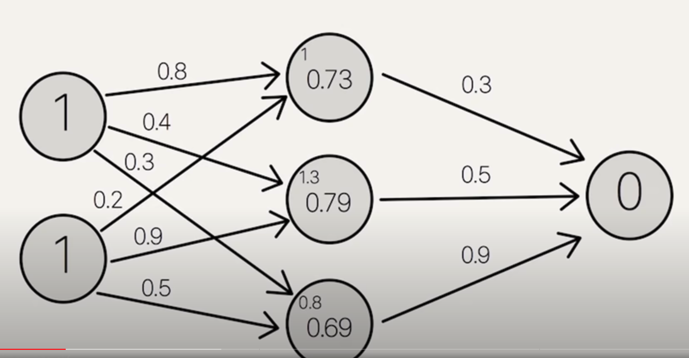
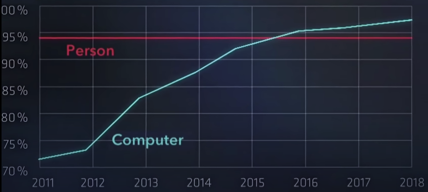

# History of AI, a Brief Timeline

### Resources

[Timeline of AI](https://en.wikipedia.org/wiki/Timeline_of_artificial_intelligence)

[History of Artificial Neural Networks](https://en.wikipedia.org/wiki/History_of_artificial_neural_networks)

[Deep Learning History](https://people.idsia.ch/~juergen/deep-learning-history.html)

---
### 1958: The Perceptron

Frank Rosenblatt invented the perceptron, an algorithm for pattern recognition, which is essentially a single-layer neural network. 

  

Shortly after, he went on to explore deeper, multilayer perceptrons. His MLPs had a non-learning first layer with randomized weights and an adaptive output layer. Although this was not yet deep learning, because only the last layer learned.

### 1965: First Deep Learning

Successful learning in deep feedforward network architectures started in 1965 in the Ukraine (back then the USSR) when Alexey Ivakhnenko & Valentin Lapa introduced the first general, working learning algorithms for deep MLPs with arbitrarily many hidden layers (already containing the now popular multiplicative gates). A paper of 1971 already described a deep learning net with 8 layers, trained by their highly cited method which was still popular in the new millennium, especially in Eastern Europe, where much of Machine Learning was born.

### 1967-68: Deep Learning by Stochastic Gradient Descent

Ivakhnenko and Lapa (1965, see above) trained their deep networks layer by layer. In 1967, however, Shun-Ichi Amari suggested to train MLPs with many layers in non-incremental end-to-end fashion from scratch by stochastic gradient descent, a method proposed in 1951 by Robbins & Monro.

Amari's implementation (with his student Saito) learned internal representations in a five layer MLP with two modifiable layers, which was trained to classify non-linearily separable pattern classes.

### 1969: Rectified Linear Units (ReLUs)

Kunihiko Fukushima introduced rectified linear units (ReLUs) for NNs (1969). They are now widely used in CNNs and other NNs.

### 1970: Backpropagation

Seppo Linnainmaa was the first to publish what's now known as backpropagation, the famous algorithm for credit assignment in networks of differentiable nodes, also known as "reverse mode of automatic differentiation." It is now the foundation of widely used NN software packages such as PyTorch and Google's Tensorflow.

### 1972: Recurrent Neural Networks

Amari published a [paper](https://people.idsia.ch/~juergen/amari1972hopfield.pdf) on Amari-Hopfield networks, which resemble what's now known as Recurrent Neural Networks (RNNs).

### 1979: First Deep Convolutional NN

Computer Vision was revolutionized in the 2010s by a particular feedforward NN called the convolutional NN (CNN). The basic CNN architecture with alternating convolutional and downsampling layers is due to Kunihiko Fukushima, 1979. He called it Neocognitron.

### 1981: Government Interest & Funding
- The Japanese Ministry of International Trade and Industry set aside $850 million for the Fifth generation computer project.
- The UK began the £350 million Alvey project.
- DARPA founded the Strategic Computing Initiative and tripling its investment in AI between 1984 and 1988.

### 1982: Hopfield Net
- Physicist John Hopfield was able to prove that a form of neural network (now called a "Hopfield net") could learn and process information in a completely new way. This built on the Amari-Hopfield network from Amari's 1972 publication

### 1985: A Spark of Modern AI

Geoffrey Hinton "godfather of AI" invented the idea of multilayered neural networks, with nodes and weights. Node takes inputs and weights of inputs, outputs a signal if sum > 0.
- 1985 | [A Learning Algorithm for Boltzmann Machines](https://www.cs.toronto.edu/~fritz/absps/cogscibm.pdf)
- 1986 | [Learning representations by back-propagating errors](https://www.nature.com/articles/323533a0)

  

David E. Rumelhart demonstrated that backpropagation can yield useful internal representations in hidden layers of NNs. At least for supervised learning, backpropagation is generally more efficient than Amari's above-mentioned deep learning through the more general SGD method (1967), which learned useful internal representations in NNs about 2 decades earlier

Feng-hsiung Hsu begins development on Chess-playing expert system called ChipTest. In 1988 it was moved to IBM and renamed Deep Thought, and then renamed again in 1989 to Deep Blue.

### 1990: Generative Adversarial Networks / Curiosity**

Generative Adversarial Networks (GANs) are first published in 1990 in Munich under the moniker Artificial Curiosity. Two dueling NNs (a probabilistic generator and a predictor) are trying to maximize each other's loss in a minimax game. The generator (called the controller) generates probabilistic outputs (using stochastic units like in the much later StyleGANs). The predictor (called the world model) sees the outputs of the controller and predicts environmental reactions to them. Using gradient descent, the predictor NN minimizes its error, while the generator NN tries to make outputs that maximize this error: one net's loss is the other net's gain

### 1991: (Unofficial) Invention of the Transformer

Jiirgen Schmidhuber [published](https://people.idsia.ch/~juergen/FKI-147-91ocr.pdf) a paper describing an alternative to RNNs: A feedforward NN slowly learns by gradient descent to program the changes of the fast weights of another NN. Such Fast Weight Programmers (FWPs) can learn to memorize past data, too. In 1991, one of them computed its fast weight changes through additive outer products of self-invented activation patterns (now often called keys and values for self-attention). The very similar Transformers combine this with projections and softmax and are now widely used in natural language processing. For long input sequences, their efficiency was improved through Transformers with linearized self-attention whose core is formally equivalent to the 1991 Fast Weight Programmers.

### 1997: Long Short-Term Memory

Sepp Hochreiter and Jurgen Schmidhuber published Long Short-Term Memory, the most cited NN [paper](https://sferics.idsia.ch/pub/juergen/lstm.pdf) of the 20th century. A later milestone was the "vanilla LSTM architecture" with forget gate — the LSTM variant of 1999-2000 that everybody is using today, e.g., in Google's Tensorflow. Alex was lead author of our first successful application of LSTM to speech (2004). 2005 saw the first publication of LSTM with full backpropagation through time and of bi-directional LSTM (now widely used).

**Also** in 1997, Deep Blue beats Gary Kasparov in chess.

### 2009: ImageNet

ImageNet is created, a large visual database envisioned by Fei-Fei Li from Stanford University, who realized that the best machine learning algorithms wouldn't work well if the data didn't reflect the real world. For many, ImageNet was the catalyst for the AI boom of the 21st century.

### 2010: DeepMind & Google X

X (formerly Google X) is an American semi-secret research and development facility and organization founded by Google in January 2010. X has its headquarters about a mile and a half from Alphabet's corporate headquarters, the Googleplex, in Mountain View, California

DeepMind was founded in the UK by Demis Hassabis, Shane Legg and Mustafa Suleyman in September 2010.

### 2011: Google Brain

The Google Brain project began in 2011 as a part-time research collaboration between Google fellow Jeff Dean, Google Researcher Greg Corrado, and Stanford University professor Andrew Ng. Google Brain started as a Google X project and became so successful that it was graduated back to Google: Astro Teller has said that Google Brain paid for the entire cost of Google X.

### 2012: Image Recognition

Geoffrey Hinton tests artificial deep neural network on a widely used image recogniztion test, called ImageNet. AlexNet was the program, scored 75% success, way better than competitors. This generates a ton of hype, and sparks more funding/research in AI, particularly image recognition.

  

In 2013, Geoffrey Hinton was acquihired by Google.

## The Start of the Race

### 2014: Attention, the Start of the Race

The attention mechanism is introduced, which would became the foundation for the Transformer.

### 2015: OpenAI

In December 2015, Sam Altman, Greg Brockman, Reid Hoffman, Jessica Livingston, Peter Thiel, Elon Musk, Amazon Web Services (AWS), Infosys, and YC Research announced the formation of OpenAI and pledged over $1 billion to the venture. 

December 11, 2015 [announcement](https://archive.is/RcWJF) by Greg Brockman and Ilya Sutskever.

### 2016

- AlphaGo becomes supreme at Go

- Google Brain neural network learns secure encryption

December 2016, OpenAI [released](https://web.archive.org/web/20170101002022/http://www.theregister.co.uk/2016/12/05/openai_universe_reinforcement_learning/) "Universe", a software platform for measuring and training an AI's general intelligence across the world's supply of games, websites, and other applications. Intended to be the reinforcement learning version of ImageNet.

### 2017: Attention is All You Need

The Google Brain team publishes a paper titled [Attention is All You Need](https://arxiv.org/abs/1706.03762), introducing the Transformer - which is now an essential ingredient in many cutting edge models, particularly LLMs.

The key innovation is the idea of self-attention, a mechanism that allows the model to selectively choose which parts of the input to pay attention to rather than using the entire input equally.

Transformers address RNN limitations by replacing recurrance with self attention. This weighs the importance of different parts of the input without having to maintain internal state. Much easier to parallize, and eliminates vanishing & exploding gradient problem.

**Also** 2017, Tesla [poaches](https://archive.is/WZaV6) deep learning expert Andrej Karpathy from OpenAI to be its new head of Autopilot Vision.

### 2018

- OpenAI Charter is [published](https://openai.com/charter), which is later cited upon holding back powerful models like GPT-2.

- Elon [leaves](https://openai.com/blog/openai-supporters) OpenAI
In early 2018, Musk told Sam Altman, another OpenAI founder, that he believed the venture had fallen fatally behind Google, people familiar with the matter said. Musk proposed a possible solution: He would take control of OpenAI and run it himself.

Altman and OpenAI’s other founders rejected Musk’s proposal. Musk, in turn, walked away from the company — and reneged on a massive planned donation. The fallout from that conflict, culminating in the announcement of Musk’s departure on Feb 20, 2018, would shape the industry that’s changing the world, and the company at the heart of it.

February 20, 2018 [announcement](https://openai.com/blog/openai-supporters) that Elon is departing. In the same month, OpenAI switched cloud providers from Amazon to Google, signing an agreement to spend at least $63 million with the tech giant over the next two years.

### 2019

- OpenAI [shifts](https://openai.com/blog/openai-lp) from nonprofit to 'capped-profit' to [attract capital](https://techcrunch.com/2019/03/11/openai-shifts-from-nonprofit-to-capped-profit-to-attract-capital/).

July 2019, Microsoft [invests](https://openai.com/blog/microsoft-invests-in-and-partners-with-openai) $1 billion in OpenAI to develop AI technologies on Microsoft Azure.

### 2020

October 2020, GPT-3 is [released](https://web.archive.org/web/20201013163856/https://www.bloomberg.com/news/articles/2020-06-11/trillions-of-words-analyzed-openai-sets-loose-ai-language-colossus).

### Cont'd

OpenAI debtus DALL-E, text-to-image.

December 2022, ChatGPT

January 2023, Microsoft acquires 49% at $29 billion valuation.

March 14, 2023: GPT-4.

May 2023, Governance of superintelligence blog [published](https://openai.com/blog/governance-of-superintelligence)

