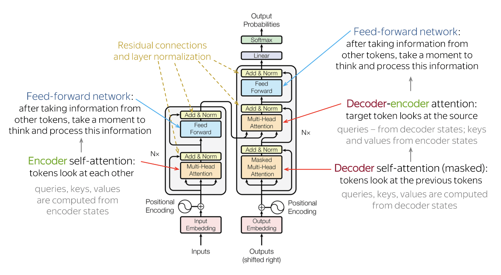

# Models

## Recurrent Neural Networks (RNNs)

RNNs were the standard architecture for NLP tasks prior to the Transformer. RNNs have the ability to maintain internal state, which allows them to remember information from previous inputs. 

Drawbacks, however, include the inability to parallize computation, as well as vanishing / exploding gradients which makes it difficult to use large sequences.

## Transformers

Transformers address RNN limitations by replacing recurrance with self attention. This weighs the importance of different parts of the input without having to maintain internal state. Much easier to parallize, and eliminates vanishing & exploding gradient problem.

  

